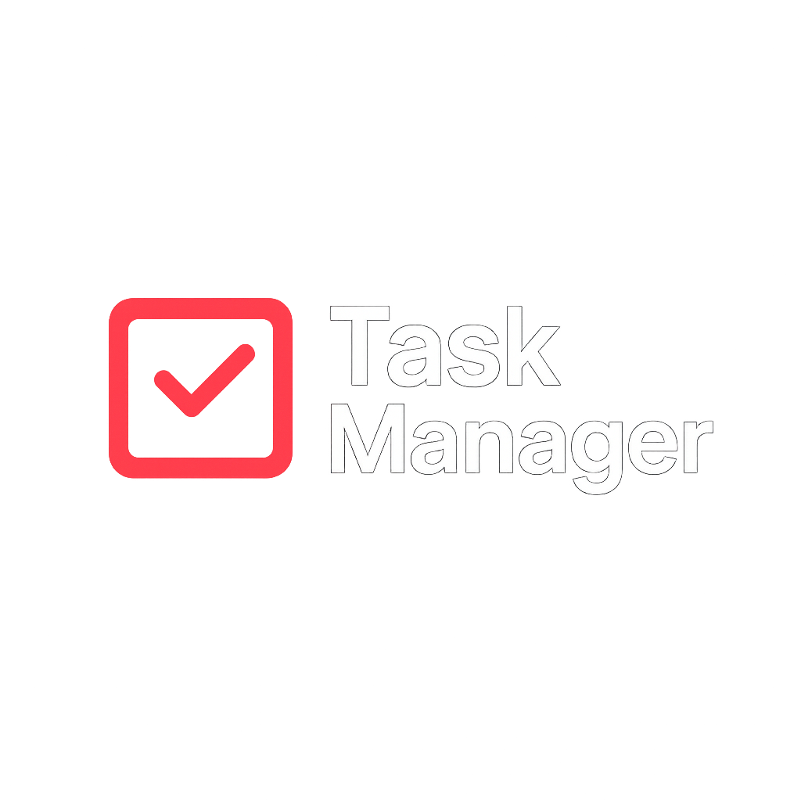
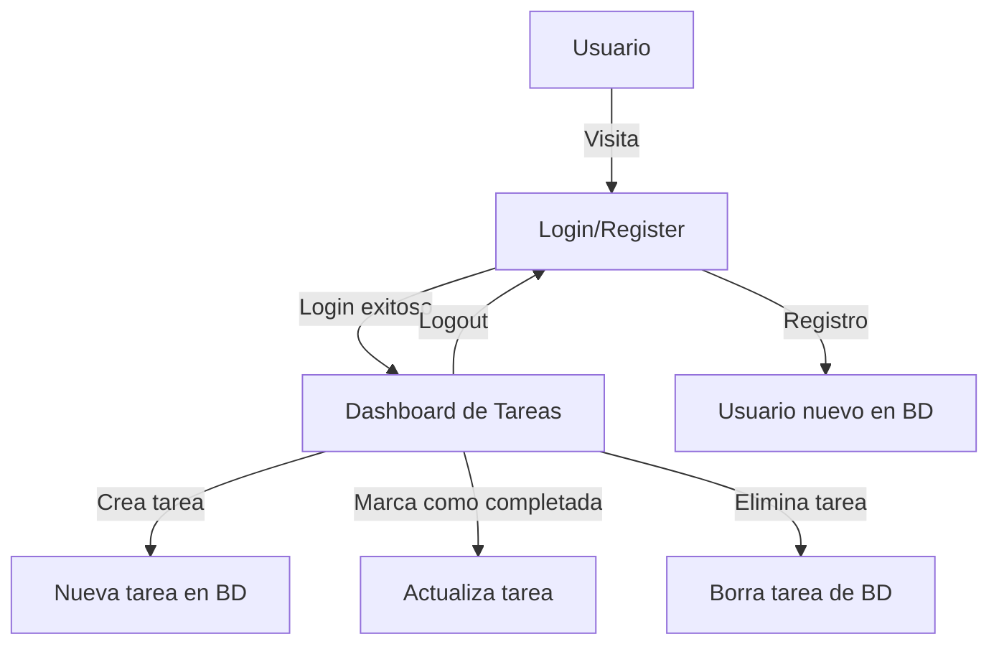

# 🚀 Task Manager - Spring Boot Application

> **🟢 Despliegue en Producción:**
> 
> Accede y prueba la app en vivo 👉 [Task Manager Spring Boot en Render](https://task-manager-springboot.onrender.com/register)

<p align="center">
  
</p>

[](https://spring.io/projects/spring-boot)
[](https://www.oracle.com/java/)
[](https://www.postgresql.org/)
[](https://www.thymeleaf.org/)
[](https://getbootstrap.com/)

---

## 📋 Descripción
Task Manager es una aplicación web moderna desarrollada con **Spring Boot** que permite a los usuarios gestionar sus tareas diarias de manera eficiente. Cuenta con autenticación segura, interfaz intuitiva y despliegue profesional en la nube.

---

## 🖼️ Imágenes de la App

### Login


### Registro


### Lista de Tareas


---

## 🛠️ Tecnologías Utilizadas
- **Backend:** Spring Boot 3.2.3
- **Frontend:** Thymeleaf + Bootstrap 5.3.2
- **Base de Datos:** PostgreSQL
- **Seguridad:** Spring Security
- **Autenticación:** BCrypt Password Encoder
- **Gestión de Dependencias:** Maven
- **Despliegue:** Docker + Render.com

---

## ✨ Funcionalidades
- ✅ Registro y autenticación de usuarios
- ✅ Gestión CRUD de tareas personales
- ✅ Interfaz responsiva y moderna
- ✅ Validación de formularios y feedback visual
- ✅ Protección CSRF y sesiones seguras
- ✅ Filtros de tareas (todas, pendientes, completadas)
- ✅ Logout seguro

---

## 🔄 Diagrama de Flujo de Funcionalidad



---

## ⚙️ Instalación y Despliegue

### 1. Clona el repositorio
```bash
git clone https://github.com/mat1520/Task-Manager-Springboot.git
cd Task-Manager-Springboot
```

### 2. Configura la base de datos PostgreSQL
```properties
spring.datasource.url=jdbc:postgresql://localhost:5432/tododb
spring.datasource.username=postgres
spring.datasource.password=tu_contraseña
```

### 3. Ejecuta localmente
```bash
./mvnw spring-boot:run
```

### 4. Despliegue en Render.com usando Docker
- Se creó un `Dockerfile` para despliegue universal.
- Render detecta el Dockerfile y construye la app automáticamente.
- Variables de entorno necesarias:
  - `DATABASE_URL`
  - `DATABASE_USERNAME`
  - `DATABASE_PASSWORD`
  - `SPRING_PROFILES_ACTIVE=prod`

#### Ejemplo de Dockerfile:
```dockerfile
FROM eclipse-temurin:17-jdk
WORKDIR /app
COPY . .
RUN chmod +x mvnw
RUN ./mvnw clean package -DskipTests
EXPOSE 8080
CMD ["java", "-jar", "target/todo-app-0.0.1-SNAPSHOT.jar"]
```

---

## 🧠 Lo que aprendimos de Spring Boot y el despliegue
- Cómo estructurar un proyecto profesional con Spring Boot y Maven.
- Seguridad con Spring Security y BCrypt.
- Uso de Thymeleaf para vistas modernas y reactivas.
- Validación de formularios y feedback visual.
- Configuración de variables de entorno para producción.
- Despliegue profesional usando Docker y Render.com.
- Solución de problemas comunes de despliegue (permisos, entorno, base de datos, etc).

---

## 👨‍💻 Autor y Créditos
- Creado por [@mat1520](https://github.com/mat1520)
- Logo y diseño UI personalizados

---

## ⭐️ ¿Te gusta el proyecto?
¡Dale una estrella en GitHub y compártelo!